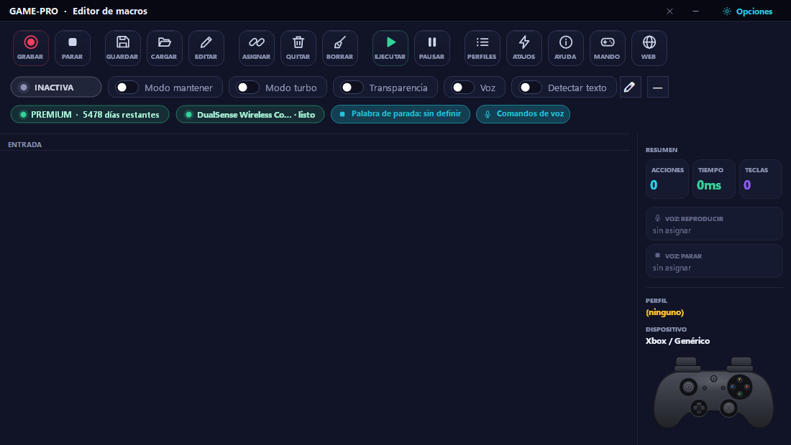

# GAME-PRO

**Graba, edita y reproduce macros de mando, teclado y ratón — con precisión de milisegundos.**

---

## ¿Qué es GAME-PRO?

GAME-PRO es una aplicación de escritorio para Windows que convierte una secuencia larga o difícil de pulsaciones —de mando, teclado o ratón— en un solo botón. Graba lo que haces exactamente como lo haces, con los mismos tiempos, y lo reproduce después con precisión, cuantas veces quieras.

No es un simple "auto-clicker": respeta los tiempos reales entre pulsaciones, reconoce combinaciones y direcciones de stick, y se integra con el mando real mientras juegas.

## Funciones principales

**🎮 Grabación y reproducción precisa**
- Graba pulsaciones de mando, teclado y ratón en la misma secuencia.
- Respeta los tiempos exactos de cada pulsación y cada pausa.
- Asigna cualquier macro a un botón del mando o una tecla — se dispara al pulsarla.
- Modo **Mantener** (se repite mientras aguantas el botón) y modo **Turbo** (empieza/para con una sola pulsación, con número de repeticiones configurable).

**🕹️ Mando animado en pantalla**
- Dibuja tu mando en tiempo real: se ilumina cada botón que pulsas, se mueven los sticks, bajan los gatillos — tanto si lo haces tú como si lo hace un macro reproduciéndose.
- Compatible con Xbox, PlayStation 4, PlayStation 5, Nintendo Switch (Pro Controller y Joy-Con), teclado y ratón — cada uno con su forma y sus botones reales.
- Si mueves el mando de verdad mientras un macro se está reproduciendo, prevalece lo que tú haces en ese instante.

**🗣️ Activación por voz, sin internet**
- Di una palabra y dispara el macro asignado — el reconocimiento es local, no necesita conexión.

**👁️ Detección de texto en pantalla (OCR)**
- La app puede leer texto en la pantalla (por ejemplo, un aviso del juego) y disparar un macro automáticamente al detectarlo.

**📋 Perfiles**
- Guarda configuraciones completas (todas tus asignaciones) como perfiles independientes y cambia entre ellas al instante — un perfil por juego, por personaje, por lo que quieras.

**🛠️ "Arregla mi mando"**
- Si tu mando no se reconoce bien, un asistente guiado (paso a paso, con pruebas en vivo) lo calibra a mano sin que tengas que tocar ningún ajuste técnico.

**🌐 Plataforma web integrada**
- Sube tus macros para que otros los descarguen, y descarga los que suban otros usuarios — todos firmados digitalmente para garantizar que vienen de la app oficial.

## Licencias

GAME-PRO ofrece **5 días de prueba gratis** al crear una cuenta nueva, sin necesidad de tarjeta de crédito. Después, puedes elegir entre licencia **semanal**, **mensual** o **anual**, con cancelación libre en cualquier momento.

## Requisitos

- Windows 10/11 (64 bits).
- No hace falta instalar nada de Microsoft por separado — el instalador lo incluye todo.

## Instalación

1. Descarga el instalador desde la [última versión](https://github.com/josako28/game-pro-releases/releases/latest).
2. Ejecútalo y acepta el permiso de administrador (necesario una sola vez, para el componente que permite emular el mando).
3. Espera a que termine — no hace falta instalar nada más por separado.
4. Crea tu cuenta gratuita y empieza a grabar tu primer macro.

## Código fuente

Este repositorio distribuye únicamente el instalador. El código fuente es propiedad exclusiva del autor y no se distribuye públicamente — consulta el archivo `LICENSE` para más detalles.

## Soporte

¿Dudas, problemas o sugerencias? Usa la sección de soporte dentro de la propia app, o el apartado de [Issues](https://github.com/josako28/game-pro-releases/issues) de este repositorio.
